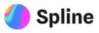

<!-- markdownlint-disable -->
<h1 align="center">Hi 👋, I'm Aditya Sharma</h1>

<h3 align="center">
MERN Stack Developer ● Full-Stack & Real-Time Applications  
Building chat apps with Socket.io ● Learning AI/ML, AWS & Apache Kafka   
🎓 Graduate of Sister Nivedita University
</h3>

  

  

<h2 align="left">
  Connect with me:
</h2>

  
  
  
  
  

  

<h2 align="left">
  
  Languages & Tools
</h2>

  <!-- Languages -->
  
  
  
  

  <!-- Frontend -->
  
  
  
  
  
  

  <!-- Backend & Databases -->
  
  
  
  
  
  
  

  <!-- DevOps & Tools -->
  
  
  
  
  
  
  

  <!-- Design -->
  
  
  

